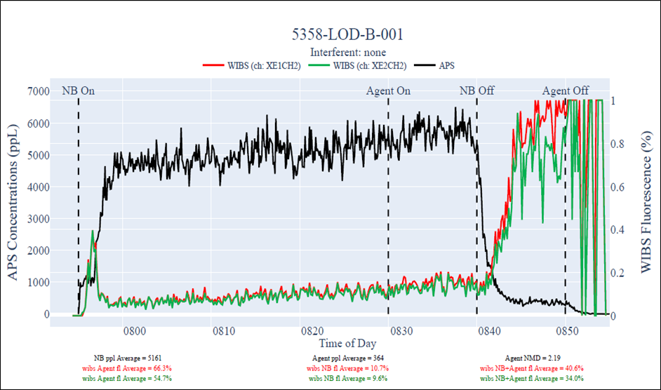

# Wideband Integrated Bioaerosol Sensor Data Analysis  

## Introduction  
This project will focus on developing a data extraction, analysis, and plotting method for the System X test currently underway at my work.  This particular test uses various instruments to measure signal responses and particle sizes throughout the trial.  Historically, we have used custom software developed by the Wideband Integrated Bioaerosol Sensor (WIBS) instrument manufacturer to record, analyze, and plot the data and required calculations.  Unfortunately, due to increased network security issues, we are no longer able to use this software on a government computer system. Therefore, this project will focus on developing a Jupyter Notebook script to perform the necessary calculations and plots for the System X test.  This report will also act as a user’s guide to the Jupyter Notebook so that future users can understand the calculations and included code.  

## Data Sources Used  
There are six files that are required for each test.  Because of the nature of the data, I am not able to post it in this repository.  There are loaded DataFrames in the Jupyter Notebook that can provide the reader with a sample of what the data look like.  
1. WIBS File: this is the main file recorded from the instrument during the test.  It uses the h5 data format.  
2. WIBS FT File: this is also a file produced by the WIBS instrument and is called the Force Trigger (FT) file.  The FT file serves as a background measurement that is recorded before the test begins.  This is also in the h5 format.  
3. Test Log File: this is a file that records each of the tests conducted on a certain day.  The file also contains the start and stop times for each trail, which is required for certain calculations.  This test log file is a simple csv file.  
4. APS File 1: there are three Aerodynamic Particle Sizer (APS) files that are needed for each individual WIBS file.  The APS instruments measure particle size diameters and are used a referee devices for the tests.  The files are in txt format.  
5. APS File 2: the second of the APS instrument files.  
6. APS File 3: the third of the APS instrument files.  

## Technologies Used  
* Python 3+  
* Jupyter Notebook 5.7.8  

## Required Packages  
```Python
import numpy as np
import pandas as pd
import h5py
import matplotlib.pyplot as plt
import datetime as dt
from datetime import datetime  
from datetime import timedelta
from PyQt5.QtWidgets import QFileDialog
import csv
import plotly.graph_objects as go
from plotly.subplots import make_subplots
import datetime as dt
import numpy as geek
```  

## Analysis Methods Used  
* Data extraction  
* Graphic analysis  

## Deployment  
This methodology is currently being used by scientists to process collected test data.  The code is able to calculate the following:  
1. WIBS Agent Fluorescence Average for Xe1 data channel  
2. WIBS Agent Fluorescence Average for Xe2 data channel  
3. WIBS Natural Background Fluorescence Average for Xe1 data channel  
4. WIBS Natural Background Fluorescence Average for Xe2 data channel  
5. WIBS Natural Background + Agent Fluorescence Average for Xe1 data channel  
6. WIBS Natural Background + Agent Fluorescence Average for Xe2 data channel  
7. Natural Background particle per liter (ppL) Average  
8. Agent ppL Average  
9. Agent Number Mean Diameter (NMD) Average  

## Summary of Results  
The code is able to produce the necessary plot and the nine specific calculations.  In addition, all calculations are displayed on the plot as well as the three data traces.  The final plot is shown below.



